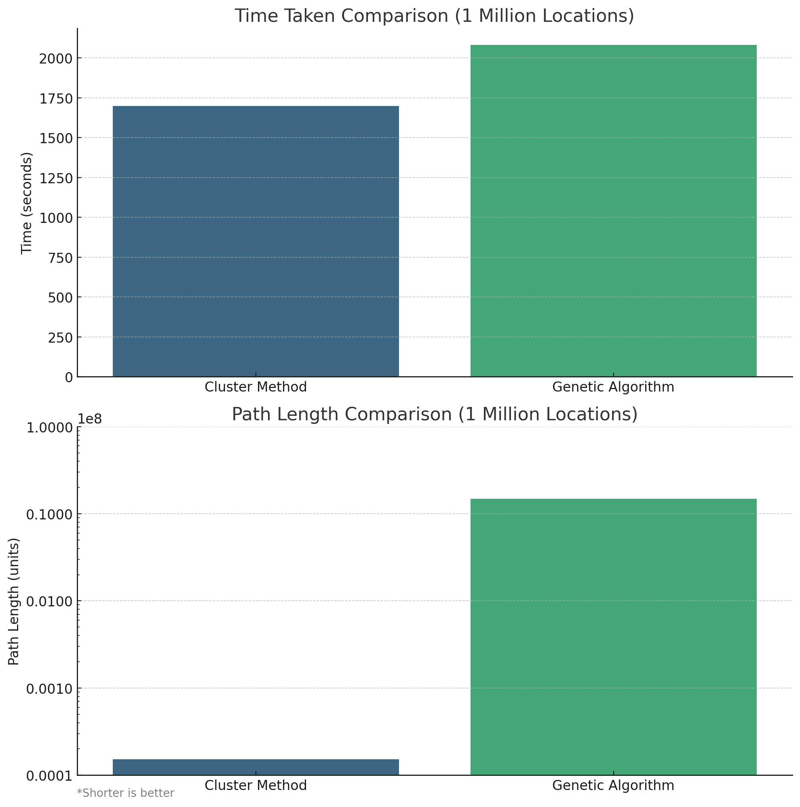
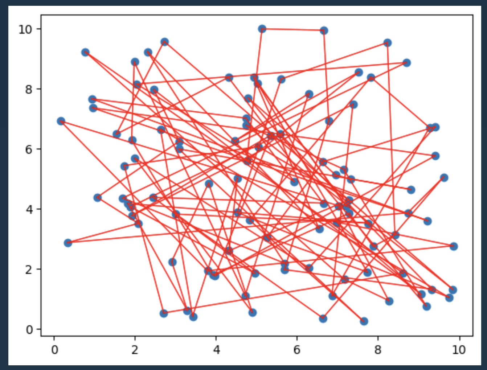
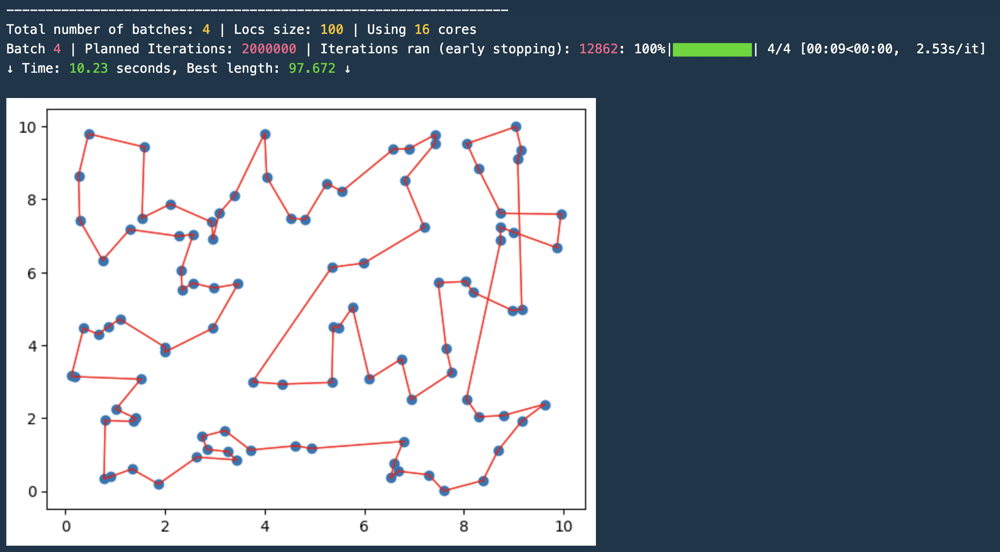
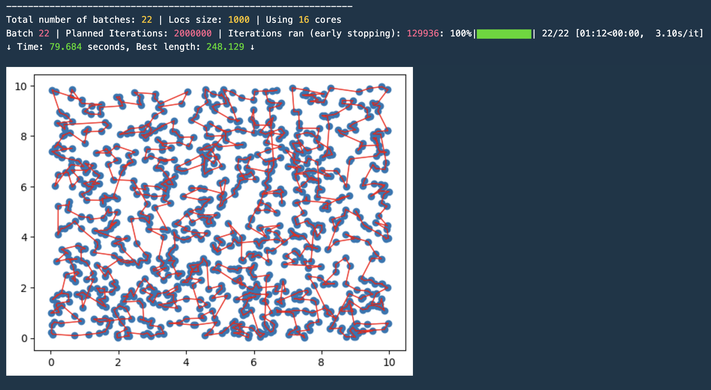
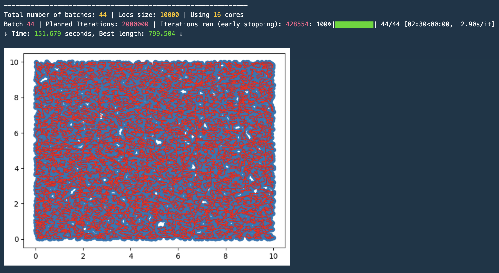
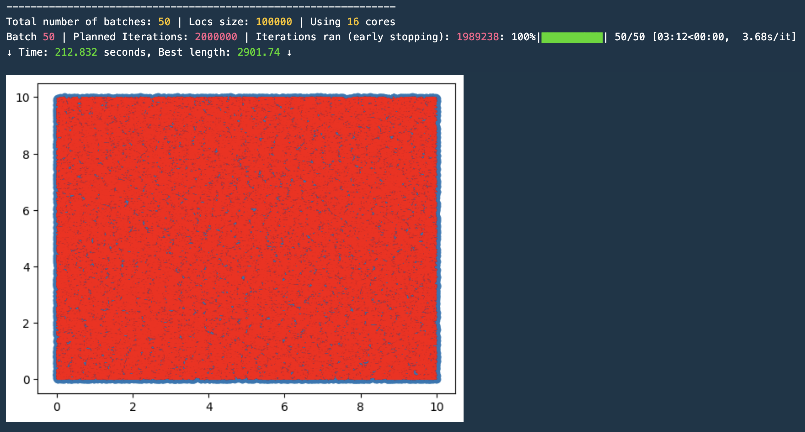
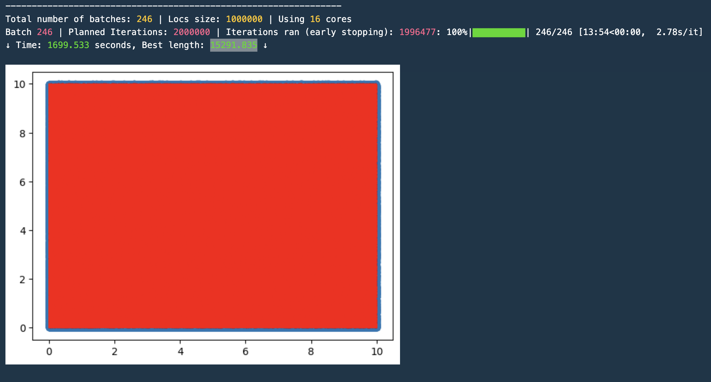
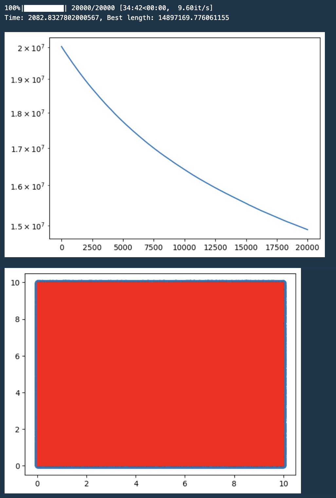

# Clustering-Based Approximation for the Travelling Salesman Problem (TSP)
The Travelling Salesman Problem (TSP) is a classic optimization problem that seeks to find the shortest path that visits a set of cities and returns to the origin. While many solutions exist, this repository introduces a hierarchical clustering-based approximation that proves to be significantly faster than some methods, especially with larger datasets.

**Key Insight:** Use hierarchical clusters and apply genetic algorithms within individual clusters, transitioning from the bottom level upwards.

## Benchmarking
For the sake of comparison, I benchmark the clustering method against two commonly used methods:
1. Minimum Spanning Tree (MST)
2. Genetic Algorithm



**Observations:**
- For a smaller number of locations (<= 100), the performance is similar to that of the MST combined with a genetic algorithm.
- The hierarchical clustering method boasts significantly faster performance with a gentle compromise in accuracy, particularly for extensive datasets.
- For a dataset with a million locations, the clustering approach delivers a path length solution that's **974 times shorter** in about **1.22 times less time** compared to the plain genetic algorithm.

## In-Depth Analysis
To understand the process, details, and methodologies used, delve into our detailed Jupyter notebook: [TSP.ipynb](#).

## Visualization & Results
### 100 Locations
- **Random Path:** 
- **Cluster Method:** 10 seconds execution time with a path length of 97 units. 

### 1,000 Locations
- **Cluster Method:** 80 seconds execution time with a path length of 258 units. 

### 10,000 Locations
- **Cluster Method:** 151 seconds execution time with a path length of 799 units. 

### 100,000 Locations
Note: MST and genetic algorithm methods were impractical for size above this level. After 24 hours of waiting on my testing machine, I had to abandon the MST as it was too time-consuming.
- **Cluster Method:** 212 seconds execution time with a path length of 2901 units. 

### 1 Million Locations
- **Cluster Method:** 1699 seconds execution time with a path length of 15291 units. 
- **Genetic Algorithm:** For comparison, the genetic algorithm took 2082 seconds to produce a path of 14897169 units in length. That's a length **974 times longer** than the clustering method. 

```bibtex
@misc{Yin,
  author = {Yin, Don},
  title = {Clustering-Based Approximation for the Travelling Salesman Problem (TSP) using Hierarchical Clusters and Genetic Algorithms},
  year = {2024},
  howpublished = {\url{https://github.com/Don-Yin/Clustering-Travelling-Salesman-Problem}},
  note = {Accessed: 2024-03-31}
}
```
